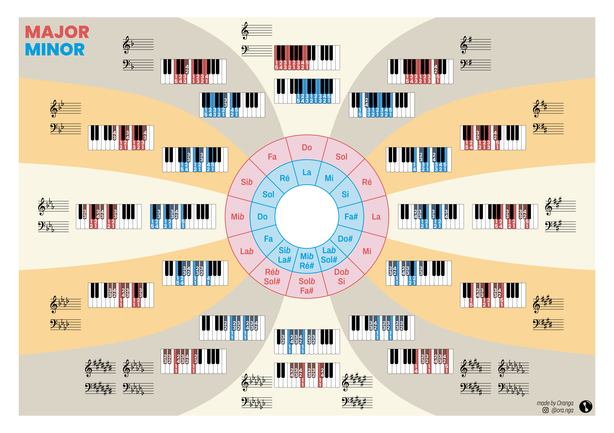

# Piano Scales Poster

This poster is a visual reference to help pianists / producers learn and identify the major and minor scales.

## How to use this poster
### The different versions
First of all, there are 2 versions of the poster:
1. English notation (A, B, C, D, F, G)
2. Solfège notation (Do, Ré, Mi, Fa, Sol, La, Si, Do)

Both versions are available in 2 different colors: classic and legacy.

You can download the version you want from the [Releases](https://github.com/0ranga/piano-scales/releases) tab, in the "Assets" section you will find the corresponding file (you don't need to download the "source code" files).

**This is the classic version:**

*English notation*

*Solfège notation*

**This is the legacy colors version:**

*English notation*

*Solfège notation*

### Why is it represented around a circle?
The circle that you see is called the circle of fifths. It highlights the relation between scales by placing the closest scales next to each other.

*For example: The closest scales to C are F and G, there is only one note that changes from F to C, same when you go from C to G.*

### What are the blue scales and the red scales?
It was chosen to only show the major and the minor scales because those are the most common scales in western music, classical and jazz. (To be more precise, the minor scales are the natural ones on the poster.)
There are 12 major scales and 12 minor scales, the red ones are the major and the blue ones are the minor.

### What are the numbers on the keys?
The numbers are the fingerings for the piano. On the top you can see the right hand fingerings and on the bottom the left hand fingerings. It was chosen to put them in that specific order to be consistent with the grand staff that puts the right hand on top and the left hand at the bottom.

## You can help make this poster better!
If you want to help make this poster better or this description, don't hesitate to contact me via this github, go ahead and create an issue in the [Issues](https://github.com/0ranga/piano-scales/issues) tab, where you can specify what is it that needs to be changed or made better, I'll do my best to answer you suggestion and act accordingly.

## Want to help me?
This poster is provided to everyone for free, however if you'd like to say thanks or help support my work, feel free to send me a little something!

